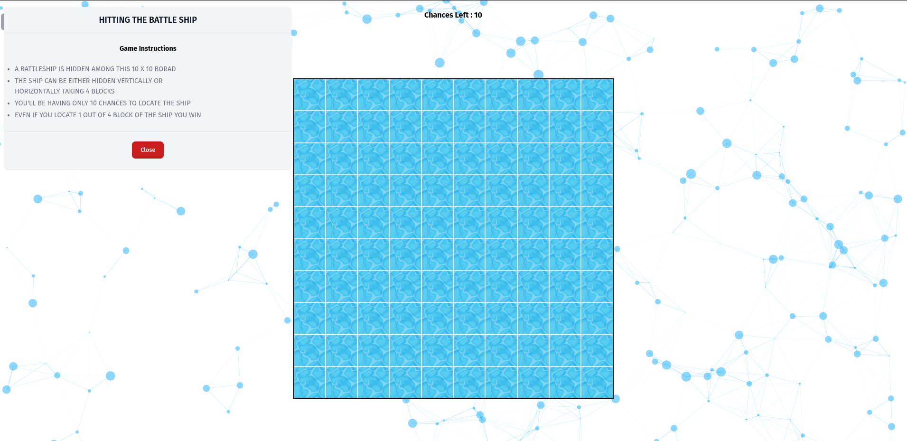

# Battleship Game - HTML, CSS, and jQuery

This repository contains a Battleship game implemented as part of an assignment for the **Design and Analysis** course in our Master's program. The game is built using HTML, CSS, and jQuery, and it allows players to play the classic game of Battleship.

## Table of Contents

- [Introduction](#introduction)
- [Game Rules](#game-rules)
- [Installation](#installation)
- [Usage](#usage)
- [Contributors](#contributors)

## Introduction

Battleship is a strategy game where one player has to guess the locations of the fleet of ships on a grid. The objective is to sink the ship before the chance runs out yours. This digital implementation of the game brings the classic fun to the digital world.

## Game Rules
- A BATTLESHIP IS HIDDEN AMONG THIS 10 X 10 BORAD
- THE SHIP CAN BE EITHER HIDDEN VERTICALLY OR HORIZONTALLY TAKING 4 BLOCKS
- YOU'LL BE HAVING ONLY 10 CHANCES TO LOCATE THE SHIP
- EVEN IF YOU LOCATE 1 OUT OF 4 BLOCK OF THE SHIP YOU WIN

## Installation

1. Clone the repository: `git clone https://github.com/nikesh15x/BattleShip-Game.git`
2. Navigate to the project directory: `cd BattleShip-Game`

## Usage

1. Open the `index.html` file in a modern web browser.
2. The game will provide feedback on hits and misses.
3. Once one of the block is hit, the game will display a victory message.

## Feedback

If you have any feedback, please reach out to us at talk2singhnikesh65@gmail.com

Feel free to explore, learn from, and modify the game as needed. If you have any suggestions or improvements, we welcome your contributions!

